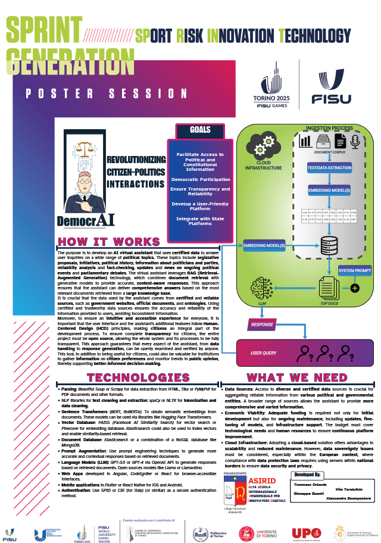

# DemocrAI

DemocrAI è un assistente virtuale basato sull'IA progettato per semplificare l'accesso alle informazioni politiche e promuovere una maggiore partecipazione democratica. L'applicazione è accessibile sia su dispositivi mobili che desktop e si basa su fonti certificate per garantire trasparenza e affidabilità. Inoltre, è open-source, favorendo il contributo della comunità allo sviluppo.
Questo progetto sarà/è stato presentato alle **UNIVERSIADI BRAINSTORM DI TORINO 2025** sotto la categoria **DEMOCRACY**.

# Poster




## Funzionalità principali

- **Gestione delle chat**: 
  - Invio e ricezione di messaggi tramite interfaccia al modello.
  - Analisi del sentiment dei messaggi.

- **Documenti e embedding**:
  - Caricamento e indicizzazione di documenti PDF e di testo.
  - Suddivisiones dei documenti per un'efficace ricerca delle informazioni.
  - Utilizzo di modelli AI per l'estrazione del contesto e risposte basate sui documenti.

- **Autenticazione**:
  - Sistema di login per utenti e amministratori.
  - Middleware per la protezione delle aree riservate.

- **Interfaccia utente**:
  - Design responsive con modalità scura e chiara.
  - Animazioni.

## Struttura del progetto

### Backend

1. **`app.py`**
   - Core dell'applicazione Flask.
   - Gestione delle rotte per il login, CRUD degli utenti e API delle chat.
   - Configurazione di MongoDB e SQLite.

2. **`ModelManager.py`**
   - Gestore dei modelli AI scaricati da Ollama.
   - Supporta la gestione del contesto e la creazione di prompt standardizzati.

3. **`OllamaTools.py`**
   - Strumenti per il caricamento, preprocessamento e indicizzazione dei documenti.
   - Strumenti per il retrieving dei documenti data una query.

4. **`MongoLayer.py`**
   - Funzioni CRUD per la gestione delle chat e dei messaggi nel database MongoDB.

### Frontend

1. **Pagine HTML**
   - **`animation.html`**: Pagina iniziale con animazione di benvenuto e presentazione del Logo.
   - **`chat.html`**: Interfaccia principale della chat.
   - **`index.html`**: Pagina di login per gli utenti.
   - **`admin_login.html`**: Pagina di login per l'amministratore.
   - **`add_user.html`**: Modulo per aggiungere nuovi utenti.
   - **`view_users.html`**: Lista degli utenti con azioni di gestione.
   - **`error.html`** e **`401.html`**: Pagine per la gestione degli errori.

2. **Stili CSS**
   - **`chat-style.css`**: Stile specifico per la pagina della chat.
   - **`style.css`**: Stile generale per altre pagine, incluse animazioni e temi.

3. **JavaScript**
   - **`script.js`**: Logica client-side per la gestione dei messaggi, animazioni e cambi di tema.

### Configurazione

1. **`.env`**
   File per le configurazioni sensibili (non incluso nel repository). Esempio (bisogna crearlo e posizionarlo nello stesso path di app.py):

   ```env
   # Modello AI da utilizzare
   MODEL=<nome_modello_ollama> # Bisogna installare ollama e scaricare un modello preventivamente.

   # Hash della password amministratore
   ADMIN_PASSWORD_HASH=<hash_password_amministratore>

   # URI del database MongoDB
   MONGO_URI=mongodb://localhost:27017/nome_database

   # Parametri embedding, retrieving e costruzione del chromaDB
   EMBEDDING_MODEL=<nome_modello_embedding> # Bisogna scaricare un modello preventivamente da ollama
   CHUNK_SIZE=512
   CHUNK_OVERLAP=50
   EMBEDDING_MODE = semantic
   PIPELINE_SPACY = <it_core_news_lgs> #Bisogna scaricare la pipeline spacy preventivamente
   CHUNKING_TYPE = semantic #Indica la tipologia di chunking da utilizzare per la costruzione del chromaDB
   SIMILARITY = 0.20 
   TOP_K = 4
   BUILD_DB = False #True all'avvio di app.py costruirà prima il DB.
   CHUNK_SIZE = 512
   CHUNK_OVERLAP = 50
   PREPROCESS_TEXT = True # Applica Lemmatizzazione ed elimina stopword prima dell'indicizzazione e calcolo embeddings (viene effettuato sempre prima di fare query al retriever)

   DOCUMENTS_PATH = C:\Users\tomma\Desktop\UniversiadiBRAINstorm2025\DemocrAI\documents
   CHROMA_DB_PATH = C:\Users\tomma\Desktop\UniversiadiBRAINstorm2025\DemocrAI\chroma_db
   LLM_PROMPT_PATH = C:\Users\tomma\Desktop\UniversiadiBRAINstorm2025\DemocrAI\Lib\prompt.txt
   PROMPT_CHUNKING_PATH_AGENTIC = C:\Users\tomma\Desktop\UniversiadiBRAINstorm2025\DemocrAI\Lib\agent_prompt.txt #TODO
   ```

2. **Database**
   - **MongoDB**: Per la gestione delle chat.
   - **SQLite**: Per la gestione degli utenti.
   - > l'aggiunta di nuovi utenti deve essere fatta tramite route *'/admin/add_user'* dopo aver inserito la password di amministratore.

## Installazione

1. Clona il repository:
   ```bash
   git clone <URL_DEL_REPOSITORY>
   cd DemocrAI
   ```

2. Installa le dipendenze:
   ```bash
   pip install -r requirements.txt
   ```

3. Configura il file `.env` seguendo l'esempio fornito.

4. Avvia il server:
   ```bash
   python app.py
   ```

5. Accedi all'applicazione da [http://localhost:5000](http://localhost:5000).

# TODO Checklist

## Funzionalità da Implementare
- [ ] Implementare KB e Ontologie
- [ ] Integrare e testare AgentChunking
- [ ] Migliorare la sicurezza generale della webAPP
- [ ] Migliorare l'accesso concorrente al modello e alle risorse
- [ ] Implementare chat salvate su MongoDB e rinomina
- [ ] Implementare memoria delle domande e risposte passate

## Bug da Risolvere
- [ ] Dopo il submit della query sulla pagina: scrolldown all'incomingMessage del modello
- [ ] Bug dell'eliminazione da MongoDB e ricaricamento pagina (deve riapparire la home normale della chat)
- [ ] Interrompere la generazione della risposta quando l'utende cestina la chat

## Miglioramenti
- [ ] Integrazione con altre fonti di dati certificati
- [ ] Miglioramento dell'analisi del sentiment
- [ ] Supporto per più lingue

## Contribuisci

Contributi sono benvenuti! Segui questi passi per contribuire:

1. Fai un fork del repository.
2. Crea un branch per le tue modifiche:
   ```bash
   git checkout -b feature/nome_feature
   ```
3. Fai il commit delle tue modifiche:
   ```bash
   git commit -m "Descrizione delle modifiche"
   ```
4. Invia una pull request.

## Licenza

Questo progetto è rilasciato sotto la licenza MIT. Consulta il file `LICENSE` per maggiori dettagli.

